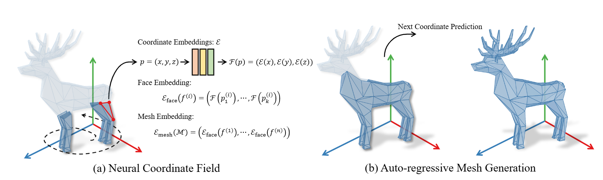

<!--      -->
<div align= "center">
    <h1> Official repo for MeshXL</h1>

</div>

<div align="center">
    <h2> <a href="https://arxiv.org/abs/2405.20853">MeshXL: Neural Coordinate Field for Generative 3D Foundation Models</a></h2>

<p align="center">
  <a href="https://meshxl.github.io/">Project Page</a> •
  <a href="https://arxiv.org/abs/2405.20853">Arxiv Paper</a> •
  <a href="">HuggingFace Demo</a> •
  <a href="#-citation">Citation
</p>

</div>

<div align="center">

<!--  -->

<!-- |                                                   Teaser Video                                                   |                                                    Demo Video                                                    |
| :--------------------------------------------------------------------------------------------------------------: | :--------------------------------------------------------------------------------------------------------------: |
| <video src="https://github.com/OpenMotionLab/MotionGPT/assets/120085716/a741e162-b2f4-4f65-af8e-aa19c4115a9e" /> | <video src="https://github.com/OpenMotionLab/MotionGPT/assets/120085716/ae966d17-6326-43e6-8d5b-8562cf3ffd52" /> | -->

</div>

<!-- ### [MeshXL: Neural Coordinate Field for Generative 3D Foundation Models](https://motion-gpt.github.io/) -->
<!-- ### [Project Page](https://motion-gpt.github.io/) | [Arxiv Paper](https://arxiv.org/abs/2306.14795) | [HuggingFace Demo](xxx) -->


## 🏃 Intro MeshXL

**MeshXL** is a family of generative pre-trained foundation models for 3D mesh generation. With the Neural Coordinate Field representation, the generation of unstructured 3D mesh data can be seaminglessly addressed by modern LLM methods. In this paper, we validate the **Neur**al **C**oordinate **F**ield (NeurCF), an explicit coordinate representation with implicit neural embeddings, is a simple-yet-effective representation for large-scale sequential mesh modeling.




## 🚩 News

- [2024/08/29] Upload code and [weights](https://huggingface.co/CH3COOK/x-mesh-xl-350m/blob/main/pytorch_model.bin) for text-to-mesh generation, welcome to check it out!
- [2024/07/24] Upload the inference code and pre-trained weights.
- [2024/06/02] Upload paper and init project.


## ⚡ Quick Start


<details>
  <summary><b>Environment Setting Up</b></summary>

  You can build the environment using the provided script:
  ```{bashrc}
  bash set_env.sh
  ```

</details>


<details>
  <summary><b>Data</b></summary>

  Work in progress...

</details>


## 💻 Training and Evaluation

<details>
  <summary><b>Download Pre-Trained Weights</b></summary>

  **\[Special Notes\]**: All the currently released weights are only used for **unconditional** 3D mesh generation.

  We provide pre-trained weights for different sizes of models (i.e. `125m`, `350m`, and `1.3b`) on huggingface. Download the pre-trained weights from the links below to replace the `pytorch_model.bin` files in the corresponding folders under the `./mesh-xl/` folder. The model details are shown below:

  | Model Size | #Layers | #Heads | $d_\text{model}$ | $d_\text{FFN}$ | GPU Hours |                    Download Link                    |
  |:----------:|:-------:|:------:|:----------------:|:--------------:|:---------:|:---------------------------------------------------:|
  |    125M    |    12   |   12   |        768       |      3072      |    1944   | [download link](https://huggingface.co/CH3COOK/mesh-xl-125m) |
  |    350M    |    24   |   16   |       1024       |      4096      |    6000   | [download link](https://huggingface.co/CH3COOK/mesh-xl-350m) |
  |    1.3B    |    24   |   32   |       2048       |      8192      |   23232   | [download link](https://huggingface.co/CH3COOK/mesh-xl-1.3b) |


</details>


<details>
  <summary><b>MeshXL Generative Pre-Training</b></summary>

  Work in progress...

</details>


<details>
  <summary><b>Generating Samples</b></summary>

  

  To generate 3D meshes with different sizes, feel free to use the following commands. By default, we generate samples with 8 GPUs and the top-k top-p sampling strategy for diverse samples.
  
  ```{bashrc}
  bash scripts/sample-1.3b.sh
  bash scripts/sample-350m.sh
  bash scripts/sample-125m.sh
  ```

  **\[Special Notes\]**: The following weights are fine-tuned for **unconditional** 3D mesh generation on a **specified** category.
  
  Want to generating shapes for a specified category? We have also uploaded the supervised fine-tuned checkpoints on `chair`, `table`, `bench`, `lamp` to huggingface too! Download the fine-tuned weights from the links below.

  | Model Size |                                              Table                                              |                                              Chair                                              |                                              Lamp                                              |                                              Bench                                              |
  |:----------:|:-----------------------------------------------------------------------------------------------:|:-----------------------------------------------------------------------------------------------:|:----------------------------------------------------------------------------------------------:|:-----------------------------------------------------------------------------------------------:|
  |    125M    | [download link](https://huggingface.co/CH3COOK/MeshXL-125m-sft/blob/main/meshxl-125m-table.pth) | [download link](https://huggingface.co/CH3COOK/MeshXL-125m-sft/blob/main/meshxl-125m-chair.pth) | [download link](https://huggingface.co/CH3COOK/MeshXL-125m-sft/blob/main/meshxl-125m-lamp.pth) | [download link](https://huggingface.co/CH3COOK/MeshXL-125m-sft/blob/main/meshxl-125m-bench.pth) |
  |    350M    | [download link](https://huggingface.co/CH3COOK/MeshXL-350m-sft/blob/main/meshxl-350m-table.pth) | [download link](https://huggingface.co/CH3COOK/MeshXL-350m-sft/blob/main/meshxl-350m-chair.pth) | [download link](https://huggingface.co/CH3COOK/MeshXL-350m-sft/blob/main/meshxl-350m-lamp.pth) | [download link](https://huggingface.co/CH3COOK/MeshXL-350m-sft/blob/main/meshxl-350m-bench.pth) |
  |    1.3B    | [download link](https://huggingface.co/CH3COOK/MeshXL-1.3b-sft/blob/main/meshxl-1.3b-table.pth) | [download link](https://huggingface.co/CH3COOK/MeshXL-1.3b-sft/blob/main/meshxl-1.3b-chair.pth) | [download link](https://huggingface.co/CH3COOK/MeshXL-1.3b-sft/blob/main/meshxl-1.3b-lamp.pth) | [download link](https://huggingface.co/CH3COOK/MeshXL-1.3b-sft/blob/main/meshxl-1.3b-bench.pth) |


  After you have downloaded the corresponding checkpoints, please use the following command to generate samples.

  ```{bashrc}
  export LLM_CONFIG='mesh-xl/mesh-xl-125m'
  # the checkpoint mush align with the $LLM_CONFIG
  export TEST_CKPT='./ckpts-meshxl-125m-sft/meshxl-125m-bench.pth'

  accelerate launch \
      --num_machines 1 \
      --num_processes 8 \
      --mixed_precision bf16 \
      main.py \
      --dataset dummy_dataset \
      --n_max_triangles 800 \
      --n_discrete_size 128 \
      --llm mesh-xl/mesh-xl-125m \
      --model mesh_xl \
      --checkpoint_dir ./outputs \
      --batchsize_per_gpu 2 \
      --test_ckpt $TEST_CKPT \
      --sample_rounds 100 \
      --dataset_num_workers 0 \
      --test_only
  ```

  Want to see more results? Check our project page out [here](https://meshxl.github.io/)!

</details>


<details>
  <summary><b>Text-to-Mesh Generation</b></summary>

  We thank the awesome language annotations from [PointLLM](https://github.com/OpenRobotLab/PointLLM) for object captions. We fine-tune a `350m` MeshXL model on Objaverse with 8 RTX-3090 GPUs. 
  
  **Note:** please download the pre-trained checkpoint from [huggingface](https://huggingface.co/CH3COOK/x-mesh-xl-350m/blob/main/pytorch_model.bin) to replace the `./mesh-xl/x-mesh-xl-350m/pytorch_model.bin` file.

  We are actively working on Gradio demos. Currently, we encourage you to generate samples locally with at least 1 GPU with the following code:

  ```{bashrc}
  bash scripts/sample-t2mesh.sh
  ```

  You are also welcome to explore other text conditions and hyper-parameters for better controls:

  ```{bashrc}
  accelerate launch \
    --num_machines 1 \
    --num_processes 1 \
    --mixed_precision bf16 \
    sample_t2m.py \
    --test_ckpt mesh-xl/x-mesh-xl-350m/pytorch_model.bin \
    --text '3d model of a table' \  # change to the text prompt you need
    --top_k 50 \                    # larger k -> larger randomness
    --top_p 0.95 \                  # larger p -> larger randomness
    --temperature 0.1               # larger temperature -> larger randomness
  ```

</details>

## 📖 Citation

If you find our code or paper helps, please consider citing:

```bibtex
@misc{chen2024meshxl,
      title={MeshXL: Neural Coordinate Field for Generative 3D Foundation Models}, 
      author={Sijin Chen and Xin Chen and Anqi Pang and Xianfang Zeng and Wei Cheng and Yijun Fu and Fukun Yin and Yanru Wang and Zhibin Wang and Chi Zhang and Jingyi Yu and Gang Yu and Bin Fu and Tao Chen},
      year={2024},
      eprint={2405.20853},
      archivePrefix={arXiv},
      primaryClass={cs.CV}
}
```

## Acknowledgments

We express our genuine thanks to the amazing work: [ShapeNet](https://shapenet.org/), [3D-FUTURE](https://tianchi.aliyun.com/specials/promotion/alibaba-3d-future-cn), [Objaverse](https://github.com/allenai/objaverse-xl), [Objaverse-XL](https://github.com/allenai/objaverse-xl), [PolyGen](https://github.com/google-deepmind/deepmind-research/blob/master/polygen/README.md), [Get3D](https://github.com/nv-tlabs/GET3D) and [MeshGPT](https://github.com/nihalsid/mesh-gpt), and the amazing [MeshGPT-pytorch](https://github.com/lucidrains/meshgpt-pytorch) codebase.
